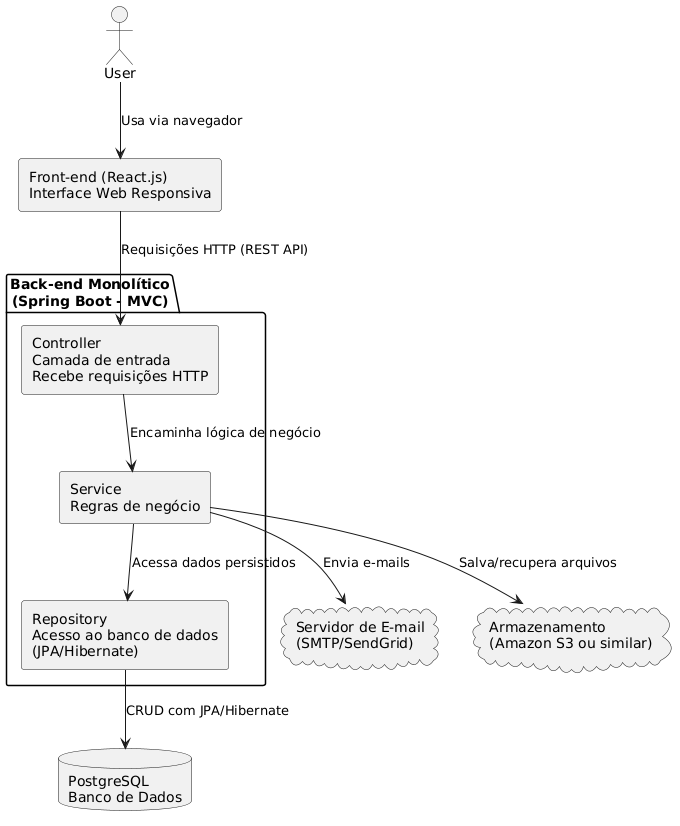
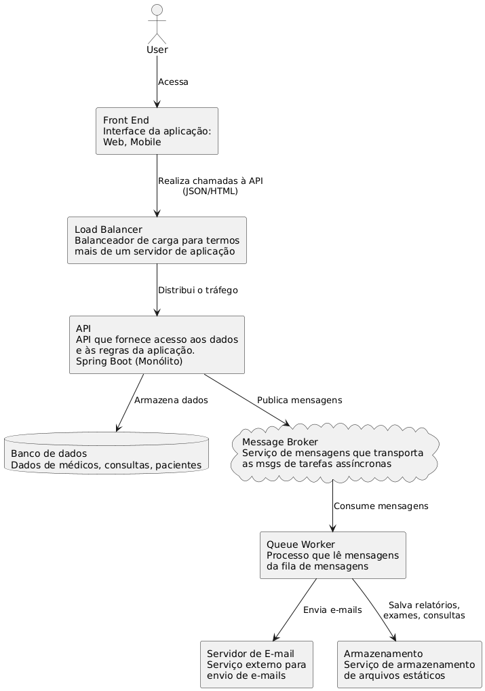

# 🏥 Documentação Oficial – Design System: Sistema de Consultas Médicas - Clínica Vida+Saúde

Trabalho desenvolvido para a disciplina Arquitetura de Software, ministrada pela Profª Angélica Guimarães no Bacharelado em Engenharia de Software da PUC Minas.

__Alunos:__
- Guilerme Cantoni
- Lívia Bontempo
- Milena Lara
- Pedro Gonçalves


__Cenário:__
```
Uma clínica médica chamada Vida+ Saúde deseja modernizar seu sistema de gestão de
consultas, que atualmente é manual. O objetivo é permitir que os pacientes agendem consultas
online, os médicos visualizem seus horários e o setor administrativo gerencie os atendimentos.

Para isso, será desenvolvido um Sistema de Gestão de Consultas Médicas, baseado na
arquitetura em 3 camadas (Apresentação, Negócio e Dados).

1️. Camada de Apresentação (Front-end - Interface do Usuário)
Esta camada é responsável pela interação com os usuários e pode ser implementada como um
sistema web responsivo.

Elementos da interface:
• Tela de Login: Pacientes e médicos devem se autenticar para acessar o sistema.
• Tela de Agendamento: Os pacientes escolhem a data e o médico disponível.
• Tela do Médico: Visualização dos agendamentos do dia.
• Tela Administrativa: O setor administrativo pode visualizar e gerenciar as consultas.

2️. Camada de Negócio (Back-end - Regras de Negócio)
Esta camada processa as regras de negócio do sistema, garantindo que os dados sejam
manipulados corretamente.

Regras de negócio principais:
• Validação de login e perfis de acesso (Paciente, Médico, Administrador).
• Restrição de agendamento para horários disponíveis.
• Cancelamento de consultas com aviso prévio ao médico.
• Relatórios sobre a quantidade de consultas realizadas por período.

3. Camada de Dados (Banco de Dados - Persistência de Informações)
Esta camada armazena os dados do sistema, garantindo integridade e segurança.

Principais tabelas:
• Usuários: Pacientes, médicos e administradores.
• Consultas: Informações do agendamento (data, hora, médico, paciente).
• Especialidades: Lista de especialidades médicas disponíveis na clínica.
```

## 📌 Visão Geral
Este documento descreve a arquitetura e os componentes principais do Sistema de Consultas Médicas.

O foco está em confiabilidade, segurança e manutenibilidade, adotando o estilo arquitetural monolítico para facilitar o desenvolvimento e a integração inicial dos módulos do sistema e padrão MVC.

## 📐 Arquitetura Geral

O sistema foi desenvolvido como uma aplicação monolítica, onde todas as funcionalidades – autenticação, agendamento, relatórios, envio de e-mails, entre outras – são integradas em um único projeto back-end.

### 🔁 Fluxo de Funcionamento

1. O usuário acessa a aplicação via navegador (front-end web responsivo).
2. As requisições são tratadas diretamente por um único servidor da aplicação.
3. A aplicação monolítica realiza todas as operações de forma centralizada:
 - Processamento das regras de negócio;
 - Acesso ao banco de dados;
 - Geração de relatórios e envio de e-mails;
 - Armazenamento e acesso a arquivos.

Logs e métricas são gerados pela própria aplicação para facilitar o monitoramento e a manutenção.

## 🧱 Componentes da Arquitetura

### 🎯 Front-end
- Interface Web desenvolvida em React.js
- Interface Mobile desenvolvida em Flutter
- Comunicação via requisições HTTP (REST) com o back-end
- Responsiva
- Integrada com sistema de autenticação/autorização.

### 🧠 API (Back-end)
- **Tecnologia:** Spring Boot (Java)
- Estruturada em camadas (controladores, serviços, repositórios)
- Controle de autenticação e autorização via JWT
- Comunicação com banco, filas, e armazenamento
- Acesso direto ao banco de dados

### 🔒 Camada de Segurança
- **Framework:** Spring Security;
- Autenticação via `/login`;
- Tokens JWT;
- Autorização baseada em roles (paciente, médico, admin)
- Criptografia de senhas com BCrypt

### 🗃 Banco de Dados
- **Tecnologia:** PostgreSQL;
- Armazena usuários, agendamentos, prontuários;
- Integração via JPA/Hibernate.

### ✉️ Envio de E-mails
- Tecnologia: JavaMailSender / SMTP (ex: SendGrid);
- Envio de e-mails diretamente pelo monólito;
- Confirmações de agendamento, lembretes e notificações.

### 📂 Armazenamento de Arquivos
- **Tecnologia:** Amazon S3 (ou compatível);
- Armazena documentos médicos, RX, exames;
- Acesso protegido e com URLs temporárias quando necessário.

### 📈 Monitoramento e Observabilidade
- Logs locais com possibilidade de integração com ELK;
- Monitoramento de saúde da aplicação com Spring Boot Actuator;
- Métricas básicas e endpoints de status para diagnóstico.

🔄 Manutenibilidade
- Estrutura modular dentro do monólito facilita a organização do código;
- Separação clara entre camadas de apresentação, negócio e dados;
- Facilita testes integrados e manutenção em ambientes pequenos/médios.

## 🔐 Segurança
- Autenticação com JWT;
- Senhas com hashing (BCrypt);
- Controle de acesso por roles;
- CORS configurado para evitar acessos não autorizados;
- Camada de segurança configurada via Spring Security.





# Roteiro para Evolução do Sistema - Back-end


## FASE 1 – MONOLITO INICIAL (MVP)

- **Estilo Arquitetural**: Monolítico  
- **Padrão Arquitetural**: MVC

### Cenário
A clínica é pequena, há poucos usuários e o sistema atende a um único ponto de atendimento. O foco é validar o funcionamento básico da aplicação.

### Características Técnicas
- Projeto único (ex: Spring Boot)
- Controladores REST com rotas como: `/consultas`, `/medicos`, `/pacientes`, `/login`
- Autenticação básica com JWT
- Banco de dados relacional único
- Deploy simples (JAR ou container único)

### Motivo para Escalabilidade após Fase 1
- Crescimento no número de funcionalidades torna o código confuso
- Equipe maior de desenvolvimento dificulta trabalho em um mesmo projeto
- Alterações em um módulo impactam outros (ex: erro em consultas pode derrubar login)
- Testes e deploy se tornam mais arriscados

### Por que evoluir?
Para modularizar os domínios do sistema e organizar o código por contexto de negócio, mantendo um único projeto, mas mais limpo e manutenível.

---

## FASE 2 – MONÓLITO MODULARIZADO

- **Estilo Arquitetural**: Monolítico  
- **Padrão Arquitetural**: MVC com separação por módulos internos

### Cenário
A clínica cresce, há novos serviços como pagamentos online, notificações e várias especialidades médicas. A equipe de desenvolvimento está maior.

### Mudanças
- Criação de pacotes/módulos separados: consultas, usuários, pagamentos, notificações, login
- Cada módulo tem seus próprios controllers, services e repositórios
- Melhor organização interna, ainda com um único deploy

### Motivo para Escalabilidade após Fase 2
- Alta demanda em certas áreas (ex: login e agendamento simultâneos) causa lentidão geral
- Manutenção em um módulo exige restart da aplicação inteira
- Desejo de escalar partes do sistema separadamente
- Início de operações em múltiplas unidades físicas ou online

### Por que evoluir?
O sistema precisa permitir deploys independentes, isolamento de falhas e escalabilidade granular. Por isso, é necessário dividir o sistema em serviços autônomos.

---

## FASE 3 – TRANSIÇÃO PARA MICROSSERVIÇOS

- **Estilo Arquitetural**: Microsserviços  
- **Padrão Arquitetural**: REST + Mensageria

### Cenário
A aplicação passa a atender múltiplas clínicas, com muitos usuários acessando simultaneamente. É necessário garantir alta disponibilidade e flexibilidade de escalar partes do sistema independentemente.

### Mudanças
- Serviços independentes: Autenticação, Consultas, Pacientes, Médicos, Pagamentos, Notificações
- Banco de dados por serviço
- Comunicação via HTTP (REST) e mensageria (RabbitMQ ou Kafka)
- API Gateway para autenticação centralizada e roteamento

### Motivo para Escalabilidade após Fase 3
- Volume de dados muito grande exige filas assíncronas para processar tarefas não críticas (notificações, logs)
- Integrações externas (ex: sistemas de saúde, gateways de pagamento) trazem latência e instabilidade
- Requisições simultâneas em larga escala precisam ser balanceadas
- Necessidade de rastreamento e análise de falhas distribuídas

### Por que evoluir?
O sistema deve tolerar falhas, continuar funcionando mesmo com serviços fora do ar, e permitir escalar horizontalmente com segurança.

---

## FASE 4 – ARQUITETURA DISTRIBUÍDA RESILIENTE

- **Estilo Arquitetural**: Microsserviços distribuídos com resiliência e observabilidade

### Cenário
A empresa se torna uma rede nacional de clínicas. Há centenas de milhares de usuários, integração com parceiros e exigência de funcionamento ininterrupto.

### Mudanças
- Load Balancer para balanceamento de carga (ex: NGINX)
- Redis para cache de dados críticos
- RabbitMQ/Kafka para eventos (ex: `ConsultaAgendadaEvent`)
- Circuit Breaker com Resilience4j para tolerância a falhas
- Monitoramento com Prometheus, Grafana, ELK Stack

